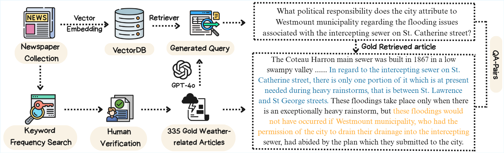
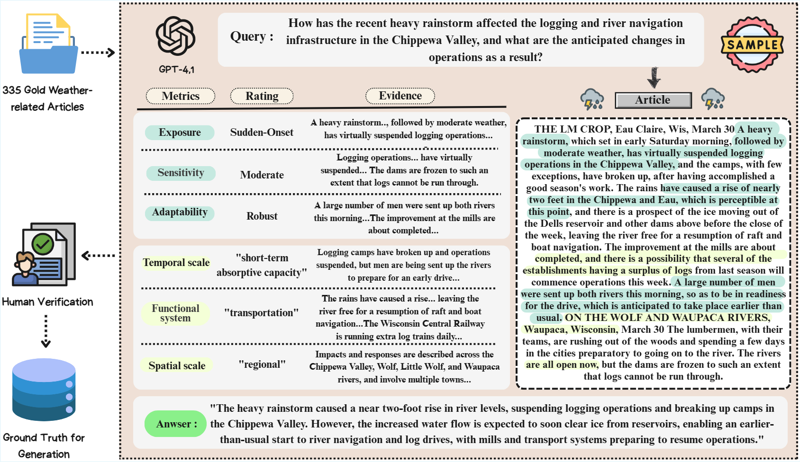

# WeatherArchive-Bench: Benchmarking Retrieval-Augmented Reasoning for Historical Weather Archives

This repository contains constructed datasets and evaluation frameworks for WeatherArchive-Bench. It comprises two tasks: WeatherArchive-Retrieval, which measures a system’s ability to locate historically relevant passages from over one million archival news segments, and WeatherArchive-Assessment, which evaluates whether Large Language Models (LLMs) can classify societal vulnerability and resilience indicators from extreme weather narratives.

## 📁 Project Structure

```
WXImpactRAG/
├── 📁 constant/                      # Configuration and constants
│   ├── climate_framework.py          # IPCC vulnerability framework definitions
│   └── constants.py                  # File paths and model configurations
│
├── 📁 data/                   # Ground truth datasets
│   ├── ground_truth_climate.csv      # Climate assessment ground truth
│   ├── QACandidate_Pool.csv          # Question-answer candidate pool
│   └── QACorrect_Passages.csv        # Correct passage annotations
│
├── 📁 WeatherArchive_Retrieval/      # Retrieval evaluation framework
│   ├── output/                       # Retrieval results
│   │   ├── overall.csv               # Comprehensive retrieval metrics
│   │   ├── raw_BM25*.csv             # BM25 variant results
│   │   ├── raw_model_result_*.csv    # Dense retrieval results
│   │   └── ...                       # Other retrieval outputs
│   ├── retriever_eval_*.py           # Retrieval evaluation scripts
│   ├── overall.py                    # Overall evaluation metrics
│   ├── utils.py                      # Utility functions
│   └── README.md                     # Retrieval framework documentation
│
└── 📁 WeatherArchive_Assessment/     # Climate impact assessment
    └── src/                          # Assessment source code
        ├── climate_eval.py           # Climate impact evaluation
        ├── MCQ_metrics.py            # Multiple choice metrics
        ├── QA_metrics.py             # Question-answering metrics
        └── rag_eval.py               # RAG evaluation framework
```

## 🔬 Experiments and Evaluation

### WeatherArchive-Retrieval

<div align="center">
    
</div>

**Objective**: Evaluate the effectiveness of various retrieval methods for historical weather data.

### WeatherArchive-Assessment

<div align="center">
    
</div>

**Objective**: Evaluate LLM performance in societal vulnerability and resilience assessment related to extreme weather events based on a well-crafted framework referenced from prior meteorological research.

## 📊 Key Results Summary

### 1️⃣ Vulnerability & Resilience (F1)

| Model            | Exposure       | Sensitivity    | Adaptability   | Temporal       | Functional     | Spatial        | Average        |
| ---------------- | -------------- | -------------- | -------------- | -------------- | -------------- | -------------- | -------------- |
| GPT-4o           | <u>0.646</u>   | 0.528          | 0.580          | 0.623          | **0.645**      | 0.518          | 0.590          |
| GPT-3.5 Turbo    | 0.636          | 0.466          | 0.465          | 0.643          | 0.342          | 0.395          | 0.491          |
| Claude Opus 4.1  | <u>_0.783_</u> | <u>_0.676_</u> | 0.675          | **0.846**      | 0.625          | **0.614**      | **0.703**      |
| Claude Sonnet 4  | 0.772          | **0.738**      | 0.597          | 0.652          | <u>_0.635_</u> | 0.603          | <u>_0.666_</u> |
| Gemini 2.5 Pro   | 0.766          | 0.620          | 0.571          | 0.756          | 0.625          | <u>_0.613_</u> | 0.658          |
| DeepSeek V3 671B | **0.798**      | 0.495          | **0.709**      | <u>_0.760_</u> | 0.613          | 0.608          | 0.664          |
| Mixtral-8x7B-IT  | 0.273          | 0.214          | 0.241          | 0.322          | 0.214          | 0.326          | 0.265          |
| Ministral-8B-IT  | 0.437          | 0.188          | 0.246          | 0.458          | 0.419          | 0.370          | 0.353          |
| Qwen3-30B-IT     | 0.658          | 0.444          | 0.300          | 0.730          | 0.342          | 0.364          | 0.478          |
| Qwen3-4B-IT      | 0.320          | 0.275          | 0.184          | 0.496          | **0.645**      | 0.285          | 0.368          |
| Qwen2.5-72B-IT   | 0.744          | 0.434          | <u>_0.676_</u> | 0.735          | 0.498          | 0.515          | 0.600          |
| Qwen2.5-32B-IT   | 0.533          | 0.312          | 0.449          | 0.609          | 0.469          | 0.365          | 0.456          |
| Qwen2.5-14B-IT   | 0.405          | 0.392          | 0.295          | 0.357          | 0.234          | 0.303          | 0.331          |
| Qwen2.5-7B-IT    | 0.338          | 0.091          | 0.225          | 0.330          | 0.308          | 0.329          | 0.270          |
| Llama-3.3-70B-IT | 0.367          | 0.429          | 0.244          | 0.481          | 0.531          | 0.355          | 0.401          |
| Llama-3-8B-IT    | 0.243          | 0.198          | 0.184          | 0.194          | 0.290          | 0.286          | 0.233          |
| **Average**      | 0.547          | 0.406          | 0.415          | 0.562          | 0.465          | 0.428          | 0.470          |

---

### 2️⃣ Retrieval – MRR@k

| Category | Model                | MRR@1           | MRR@3           | MRR@5           | MRR@10          | MRR@50          | MRR@100         |
| -------- | -------------------- | --------------- | --------------- | --------------- | --------------- | --------------- | --------------- |
| Sparse   | BM25plus             | 0.3701          | 0.4662          | 0.4796          | 0.4843          | 0.4898          | 0.4903          |
|          | BM25okapi            | 0.3015          | 0.4095          | 0.4251          | 0.4346          | 0.4395          | 0.4400          |
|          | SPLADE               | 0.0388          | 0.0542          | 0.0624          | 0.0715          | 0.0842          | 0.0866          |
| Dense    | SBERT                | 0.1522          | 0.2075          | 0.2187          | 0.2265          | 0.2307          | 0.2314          |
|          | ANCE                 | 0.1791          | 0.2498          | 0.2674          | 0.2802          | 0.2919          | 0.2931          |
|          | Arctic               | 0.3164          | 0.4114          | 0.4255          | 0.4362          | 0.4439          | 0.4452          |
|          | Granite              | 0.3134          | 0.4144          | 0.4338          | 0.4458          | 0.4543          | 0.4551          |
|          | OpenAI-3-small       | 0.3164          | 0.4075          | 0.4236          | 0.4356          | 0.4443          | 0.4453          |
|          | OpenAI-3-large       | 0.2866          | 0.3726          | 0.3883          | 0.4016          | 0.4120          | 0.4130          |
|          | OpenAI-ada-002       | 0.2985          | 0.3905          | 0.4123          | 0.4255          | 0.4339          | 0.4350          |
|          | Gemini Embedding 001 | 0.3403          | 0.4463          | 0.4651          | 0.4776          | 0.4865          | 0.4871          |
| Hybrid   | BM25plus + CE        | <u>_0.3821_</u> | <u>_0.4945_</u> | <u>_0.5136_</u> | <u>_0.5191_</u> | <u>_0.5217_</u> | <u>_0.5219_</u> |
|          | BM25okapi + CE       | **0.3851**      | **0.4965**      | **0.5140**      | **0.5202**      | **0.5229**      | **0.5231**      |

---

### 3️⃣ Retrieval – Recall@k

| Category | Model                | Recall@1        | Recall@3        | Recall@5        | Recall@10       | Recall@50       | Recall@100      |
| -------- | -------------------- | --------------- | --------------- | --------------- | --------------- | --------------- | --------------- |
| Sparse   | BM25plus             | 0.3701          | <u>_0.5851_</u> | 0.6418          | 0.6776          | 0.7910          | 0.8269          |
|          | BM25okapi            | 0.3015          | 0.5433          | 0.6119          | 0.6776          | 0.7940          | 0.8299          |
|          | SPLADE               | 0.0388          | 0.0746          | 0.1134          | 0.1821          | 0.4776          | 0.6448          |
| Dense    | SBERT                | 0.1522          | 0.2896          | 0.3403          | 0.4000          | 0.5015          | 0.5522          |
|          | ANCE                 | 0.1791          | 0.3403          | 0.4209          | 0.5224          | 0.7791          | 0.8657          |
|          | Arctic               | 0.3164          | 0.5343          | 0.5940          | 0.6746          | 0.8209          | 0.9104          |
|          | Granite              | 0.3134          | 0.5463          | 0.6299          | 0.7194          | <u>_0.8866_</u> | 0.9463          |
|          | OpenAI-3-small       | 0.3164          | 0.5164          | 0.5851          | 0.6776          | 0.8537          | 0.9194          |
|          | OpenAI-3-large       | 0.2866          | 0.4806          | 0.5493          | 0.6507          | 0.8537          | 0.9224          |
|          | OpenAI-ada-002       | 0.2985          | 0.5104          | 0.6030          | 0.7015          | 0.8806          | <u>_0.9552_</u> |
|          | Gemini Embedding 001 | 0.3403          | 0.5731          | 0.6537          | <u>_0.7493_</u> | **0.9164**      | **0.9582**      |
| Hybrid   | BM25plus + CE        | <u>_0.3821_</u> | **0.6388**      | **0.7224**      | **0.7612**      | 0.8119          | 0.8269          |
|          | BM25okapi + CE       | **0.3851**      | **0.6388**      | <u>_0.7164_</u> | **0.7612**      | 0.8179          | 0.8299          |

---

### 4️⃣ Retrieval – NDCG@k

| Category | Model                | NDCG@1          | NDCG@3          | NDCG@5          | NDCG@10         | NDCG@50         | NDCG@100        |
| -------- | -------------------- | --------------- | --------------- | --------------- | --------------- | --------------- | --------------- |
| Sparse   | BM25plus             | 0.3701          | 0.4968          | 0.5205          | 0.5320          | 0.5573          | 0.5631          |
|          | BM25okapi            | 0.3015          | 0.4439          | 0.4721          | 0.4941          | 0.5190          | 0.5247          |
|          | SPLADE               | 0.0388          | 0.0595          | 0.0749          | 0.0970          | 0.1604          | 0.1875          |
| Dense    | SBERT                | 0.1522          | 0.2283          | 0.2489          | 0.2680          | 0.2897          | 0.2978          |
|          | ANCE                 | 0.1791          | 0.2730          | 0.3055          | 0.3376          | 0.3937          | 0.4077          |
|          | Arctic               | 0.3164          | 0.4430          | 0.4679          | 0.4939          | 0.5274          | 0.5418          |
|          | Granite              | 0.3134          | 0.4482          | 0.4829          | 0.5119          | 0.5496          | 0.5592          |
|          | OpenAI-3-small       | 0.3164          | 0.4356          | 0.4642          | 0.4938          | 0.5334          | 0.5441          |
|          | OpenAI-3-large       | 0.2866          | 0.4004          | 0.4286          | 0.4613          | 0.5072          | 0.5183          |
|          | OpenAI-ada-002       | 0.2985          | 0.4213          | 0.4600          | 0.4918          | 0.5312          | 0.5434          |
|          | Gemini Embedding 001 | 0.3403          | 0.4790          | 0.5125          | 0.5432          | 0.5816          | 0.5884          |
| Hybrid   | BM25plus + CE        | <u>_0.3821_</u> | <u>_0.5316_</u> | **0.5660**      | <u>_0.5788_</u> | <u>_0.5904_</u> | <u>_0.5928_</u> |
|          | BM25okapi + CE       | **0.3851**      | **0.5330**      | <u>_0.5648_</u> | **0.5795**      | **0.5921**      | **0.5940**      |

---

## 🚀 Getting Started

### Prerequisites

```bash
pip install -r requirements.txt
```

### Running WeatherArchive-Retrieval

```bash
# BM25 variants with cross-encoder reranking
python -m WeatherArchive_Retrieval.retriever_eval_1

# Dense retrieval models
python -m WeatherArchive_Retrieval.retriever_eval_2  # SBERT, SPLADE
python -m WeatherArchive_Retrieval.retriever_eval_3  # ANCE, UniCoil
python -m WeatherArchive_Retrieval.retriever_eval_4  # Qwen models
python -m WeatherArchive_Retrieval.retriever_eval_5  # OpenAI models
python -m WeatherArchive_Retrieval.retriever_eval_6  # Arctic, Granite
python -m WeatherArchive_Retrieval.retriever_eval_7  # Gemini models

# Generate overall evaluation metrics
python -m WeatherArchive_Retrieval.overall
```

### Running WeatherArchive-Assessment

```bash
# Societal Vulnerability and Resilience Indicator Classification
python -m WeatherArchive_Assessment.src.climate_eval
# Data analyze
python -m WeatherArchive_Assessment.src.classification_metrics

# Free-form Question Answering
python -m WeatherArchive_Assessment.src.rag_eval
# Data analyze
python -m WeatherArchive_Assessment.src.QA_metrics
```

## 📝 Data Requirements

- **Input Data**: Historical weather documents in CSV format with 'Text' column
- **Queries**: Question dataset with 'query' column
- **Ground Truth**: Correct passages for evaluation
- **API Keys**: OpenAI, Google, HuggingFace (for respective models)

## 🔧 Configuration

- Model configurations in `constant/constants.py`
- Climate framework definitions in `constant/climate_framework.py`
- File paths and evaluation parameters are customizable

_This repository contains the complete implementation and evaluation framework for WeatherArchive-Bench_
